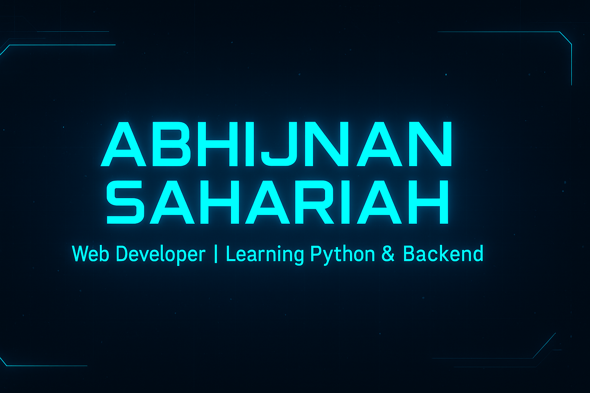

  

# 👋 Hey, I'm **Abhijnan Sahariah**  

I’m a student and self-taught developer focusing on building clean and real-world web projects.  
Currently leveling up **JavaScript** and exploring **Python** + backend fundamentals.

### 🎯 Goals
- Learn backend and APIs step-by-step  
- Build projects that feel real, not just school demos  
- Contribute to open-source and collaborate  

---

## 🌐 Socials

---

## 🧠 Tech Stack (Skills)

| Language / Tool | Badge |
|---|---|
| **HTML** |  |
| **CSS** |  |
| **JavaScript** |  |
| **Python** |  |
| **C++** |  |
| **Vercel** |  |
| **Netlify** |  |
| **VS Code** |  |

---

## 🎨 Animated Tech Icons

  

---

## 🚀 Featured Projects

| Project | Live Demo | Repo |
|--------|---------|------|
| **DevHub** | ✅ Portfolio Hub | https://github.com/AbhijnanSahariah1/DevHub |
| **Driver Monitoring System** | 🟡 Hardware IOT Project | https://github.com/AbhijnanSahariah1/DriverMonitoringSystem |
| **Multi-Game** | 🎮 Simple Fun Games | https://github.com/AbhijnanSahariah1/Multi-Game |

> Want me to add project **showcase cards**? I can generate them too.

---

## 📊 GitHub Stats

  
   
  
   
  

---

## 🏆 GitHub Trophies

---

## ✍️ Random Dev Quote
> “The best code is written when you understand the problem, not the language.”

---

### ⭐ If you like my work, consider giving a star to my repos :)
